# 智界引擎 - 开发者文档

## 项目概述

1. 这是一个纯前端项目，不添加后端
2. 只能使用提供的模型，禁止擅自添加任何模型和接口
3. 全部使用IndexedDB (通过idb库)存储数据
4. 基于Next.js的项目，使用TypeScript和Tailwind CSS

## 技术栈

- **框架**: Next.js 15.1.7
- **语言**: TypeScript
- **样式**: Tailwind CSS
- **存储**: IndexedDB (通过idb库)
- **字体**: Noto Sans SC, Noto Serif SC, Material Icons, Geist

## 项目结构

```
src/
├── app/
│   ├── globals.css       # 全局样式
│   ├── layout.tsx        # 应用布局
│   ├── page.tsx          # 主页面
│   ├── character/        # 角色相关页面
│   │   ├── create/       # 创建角色页面
│   │   └── [id]/         # 角色详情页面
│   ├── novel/            # 小说相关页面
│   ├── plot/             # 情节相关页面
│   ├── worldbuilding/    # 世界观相关页面
│   ├── prompts/          # 提示词相关页面
│   │   ├── page.tsx      # 提示词管理页面
│   │   ├── type/         # 提示词类型页面
│   │   │   └── [type]/   # 特定类型提示词页面
│   │   └── [id]/         # 提示词编辑页面
│   ├── creativemap/      # 创意地图页面
│   └── works/            # 作品相关页面
│       ├── page.tsx      # 我的作品页面
│       ├── create/       # 创建作品页面
│       └── [id]/         # 作品详情页面
│           └── page.tsx  # 作品编辑页面
├── components/           # 组件目录
│   ├── Sidebar.tsx       # 侧边栏导航组件
│   ├── BackButton.tsx    # 回退按钮组件
│   └── 其他组件
├── contexts/             # 上下文目录
│   ├── NavigationContext.tsx # 导航上下文
│   └── TodoContext.tsx   # 待办事项上下文
└── lib/                  # 工具库目录
    ├── db.ts             # IndexedDB数据库操作
    └── AIservice.ts      # AI服务接口
```

## 系统架构

```mermaid
graph TD
    A[智界引擎] --> B[用户界面]
    A --> C[数据存储]
    A --> D[AI服务接口]
    A --> E[弹窗系统]
    A --> F[导航系统]
    A --> G[组件复用系统]

    B --> B1[创作空间界面]
    B --> B2[小说创作界面]
    B --> B3[创建作品界面]
    B --> B4[作品详情编辑界面]
    B --> B5[提示词管理界面]
    B5 --> B5-1[提示词分类页面]
    B5 --> B5-2[提示词类型页面]
    B5 --> B5-3[提示词详情页面]
    B --> B6[角色管理界面]
    B --> B7[世界观界面]
    B --> B8[情节设计界面]
    B --> B9[创意地图界面]

    C --> C1[作品数据]
    C --> C2[提示词数据]
    C --> C3[章节数据]
    C --> C4[API密钥存储]

    D --> D1[内容生成]
    D --> D2[流式生成]
    D --> D3[章节格式化]
    D --> D4[系统提示词管理]
    D --> D5[API密钥管理]

    E --> E1[分析弹窗]
    E --> E2[写作弹窗]
    E --> E3[结果弹窗]
    E --> E4[提示词弹窗]
    E --> E5[设置弹窗]

    F --> F1[侧边栏导航]
    F --> F2[回退按钮]
    F --> F3[首次访问导航]

    G --> G1[提示词组件]
    G --> G2[章节组件]
    G --> G3[弹窗组件]
```

## 功能模块

### 1. 用户界面

```mermaid
graph TD
    UI[用户界面] --> Home[创作空间界面]
    UI --> Works[小说创作界面]
    UI --> Create[创建作品界面]
    UI --> Edit[作品详情编辑界面]
    UI --> Prompts[提示词管理界面]
    UI --> Character[角色管理界面]
    UI --> World[世界观界面]
    UI --> CreativeMap[创意地图界面]

    Home --> H1[导航栏]
    Home --> H2[创作卡片]
    Home --> H3[模板卡片]
    Home --> H4[统计卡片]
    Home --> H5[设置功能]

    Works --> W1[作品列表]
    Works --> W2[类型标识]
    Works --> W3[创建按钮]

    Create --> C1[作品表单]
    Create --> C2[提交功能]

    Edit --> E1[章节管理]
    Edit --> E2[编辑器]
    Edit --> E3[AI功能按钮]
    Edit --> E4[提示词选择]

    Prompts --> P1[分类区域]
    Prompts --> P2[提示词列表]
    Prompts --> P3[搜索功能]
    Prompts --> P4[导入导出]

    Character --> CH1[角色列表]
    Character --> CH2[角色详情]
    Character --> CH3[创建编辑]

    World --> WB1[世界观列表]
    World --> WB2[世界观详情]
    World --> WB3[创建编辑]

    CreativeMap --> CM1[导语生成器]
    CreativeMap --> CM2[大纲生成]
    CreativeMap --> CM3[细纲生成]
    CreativeMap --> CM4[角色设计]
    CreativeMap --> CM5[世界搭建]
    CreativeMap --> CM6[情节设计]
    CreativeMap --> CM7[世界编辑器]
    CreativeMap --> CM8[生成结果管理]

    CM7 --> CM7-1[分类侧边栏]
    CM7 --> CM7-2[内容编辑区]
    CM7 --> CM7-3[自动保存机制]
    CM7 --> CM7-4[条目管理]

    CM8 --> CM8-1[结果展示弹窗]
    CM8 --> CM8-2[内容保存功能]
    CM8 --> CM8-3[流式生成控制]
    CM8 --> CM8-4[生成终止功能]
    CM8 --> CM8-5[智能滚动功能]
```

### 2. 数据存储

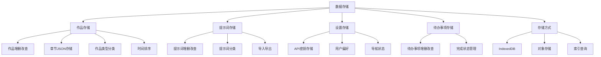

### 3. AI服务接口

```mermaid
graph TD
    AI[AI服务接口] --> Config[配置信息]
    AI --> Functions[接口功能]
    AI --> Options[选项配置]
    AI --> Implementation[实现细节]
    AI --> ErrorHandling[错误处理]

    Config --> C1[密钥存储键 (IndexedDB)]
    Config --> C2[API端点]
    Config --> C3[模型列表]

    Functions --> F1[非流式生成]
    Functions --> F2[流式生成]
    Functions --> F3[章节格式化]
    Functions --> F4[系统提示词管理]
    Functions --> F5[章节分析]
    Functions --> F6[生成中止]

    Options --> O1[模型选择]
    Options --> O2[温度设置]
    Options --> O3[最大token数]
    Options --> O4[流式输出控制]
    Options --> O5[中止信号]

    Implementation --> I1[OpenAI兼容接口]
    Implementation --> I2[AbortController支持]
    Implementation --> I3[流式响应处理]
    Implementation --> I4[模型特定配置]

    ErrorHandling --> E1[密钥未设置检查]
    ErrorHandling --> E2[网络错误处理]
    ErrorHandling --> E3[Token超限处理]
    ErrorHandling --> E4[认证错误处理]
    ErrorHandling --> E5[中止错误处理]
```

#### 流式生成与中止功能

流式生成功能允许实时显示AI生成的内容，中止功能允许用户随时停止生成过程。

##### 流式生成实现方式

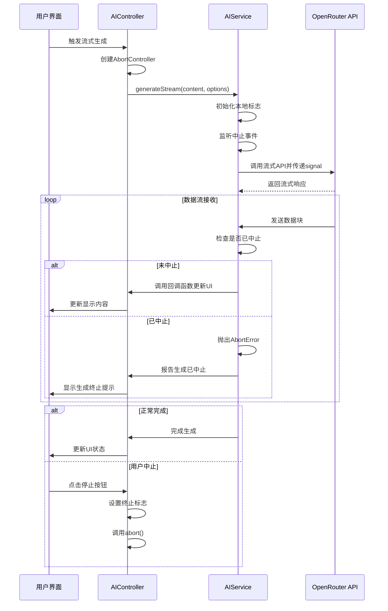

##### 中止功能实现细节

1. **AbortController**: 使用标准Web API的AbortController实现中止功能
2. **双重保护机制**:
   - 通过AbortSignal中止网络请求
   - 通过本地标志防止已接收但未处理的数据块继续更新UI
3. **清理机制**:
   - 在新生成开始前中止旧请求
   - 短延迟确保旧请求完全清理
   - 弹窗关闭时自动中止请求

##### 错误处理

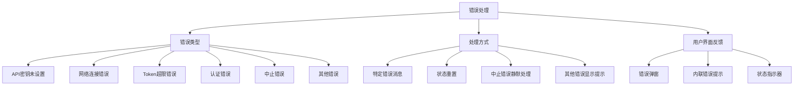

### 4. 弹窗系统

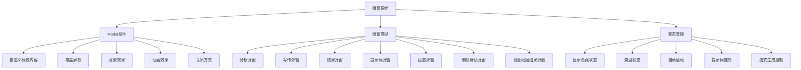

#### 创意地图结果弹窗

创意地图结果弹窗是一个特殊的弹窗类型，专用于显示AI生成的结果，具有流式显示、停止生成和保存功能。

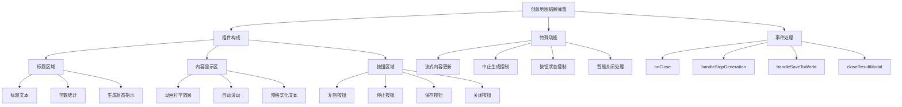

##### 按钮状态和可见性逻辑

1. **停止按钮**：仅在生成过程中（标题包含"生成中..."）显示
2. **保存按钮**：在生成过程中禁用，生成完成后启用
3. **复制按钮**：始终可用，允许随时复制当前内容
4. **关闭按钮**：始终可用，但关闭时会检查并中止任何正在进行的生成

##### 流式内容处理

创意地图结果弹窗使用动画打字效果显示内容，每行文本会应用一个微小的延迟，创造出流畅的打字效果：

```jsx
{resultModalContent && resultModalContent.split('\n').map((line: string, index: number) => (
  <div 
    key={index} 
    className="animate-typing" 
    style={{ 
      animationDelay: `${index * 0.01}s`,
      marginBottom: index < resultModalContent.split('\n').length - 1 ? '0.5em' : '0'
    }}
  >
    {line || ' '}
  </div>
))}
```

### 5. 导航系统

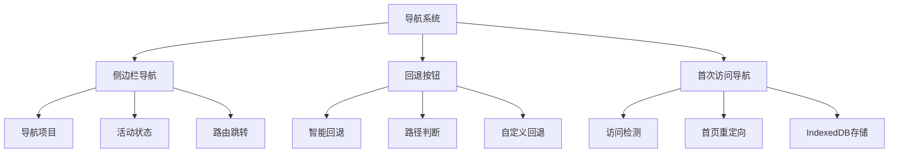

### 6. API密钥管理

```mermaid
graph TD
    APIKey[API密钥处理流程] --> Storage[存储机制]
    APIKey --> UI[用户界面]
    APIKey --> Usage[使用流程]

    Storage --> S1[IndexedDB存储]
    Storage --> S2[统一存储键]

    UI --> U1[设置弹窗]
    UI --> U2[API密钥输入]
    UI --> U3[AI功能提示(需设置密钥)]

    Usage --> US1[每次AI调用前读取]
    Usage --> US2[读取失败则报错("发送失败")]
    Usage --> US3[不缓存密钥]
    Usage --> US4[不使用默认密钥]
```

## 设计原则

1. **用户体验优先**：界面设计注重美观和易用性
2. **响应式设计**：适配不同屏幕尺寸
3. **性能优化**：使用CSS变量和组件化样式
4. **代码可维护性**：模块化结构和清晰的命名
5. **客户端/服务器一致性**：确保Next.js SSR和客户端渲染一致
6. **品牌一致性**：LOGO和标题设计保持统一风格
7. **视觉层次**：使用颜色、阴影和间距创建清晰的视觉层次
8. **微交互**：添加细微的动画和过渡效果增强用户体验
9. **圆润设计**：使用大圆角和柔和边缘，提供现代感和友好的视觉体验
10. **导航便捷性**：提供清晰的导航路径和回退选项，减少用户迷失感
11. **数据复用**：提示词管理中的提示词可在编辑器界面中复用，提高用户效率
12. **API密钥灵活性**：支持默认密钥和用户自定义密钥，确保功能可用性

## 创意地图功能

创意地图是集成了多种AI辅助创作工具的功能模块，包括导语生成、大纲生成、细纲生成、角色设计、世界搭建和情节设计等子功能，以及世界编辑器和生成结果管理功能。

### 世界编辑器

世界编辑器允许用户保存和编辑从AI生成的内容，组织成不同分类的创作素材。

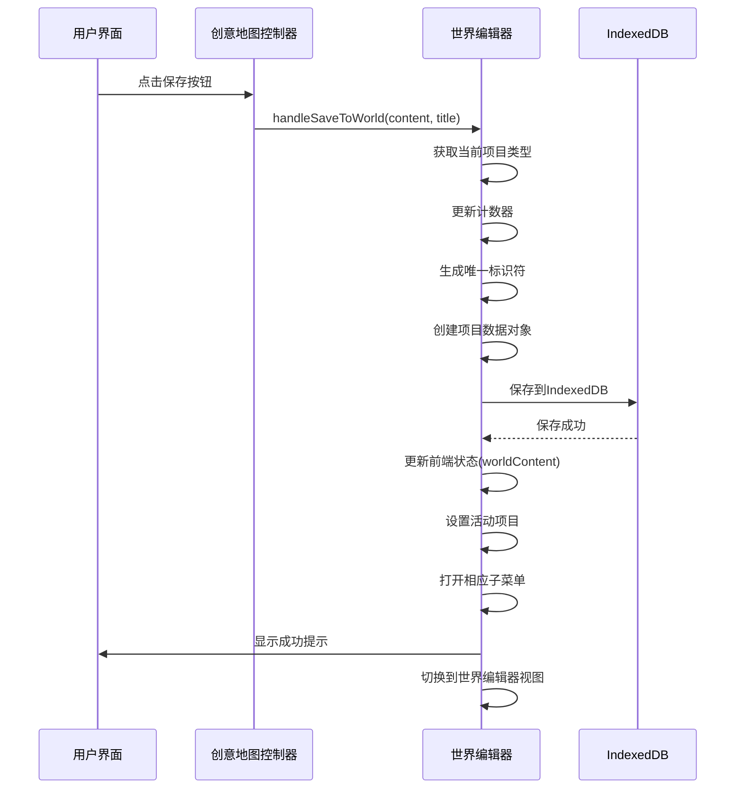

#### 世界编辑器数据模型

```typescript
interface WorldContentItem {
  id: string;           // 唯一标识符，格式为：`${类型}_${时间戳}`
  type: string;         // 项目类型，如 'introduction', 'character'等
  title: string;        // 项目标题
  content: string;      // 项目内容
  createdAt: Date;      // 创建时间
  updatedAt: Date;      // 更新时间
}
```

#### 自动保存机制

世界编辑器实现了防抖自动保存机制，当用户编辑内容或标题时，会在短暂延迟后自动保存到IndexedDB。

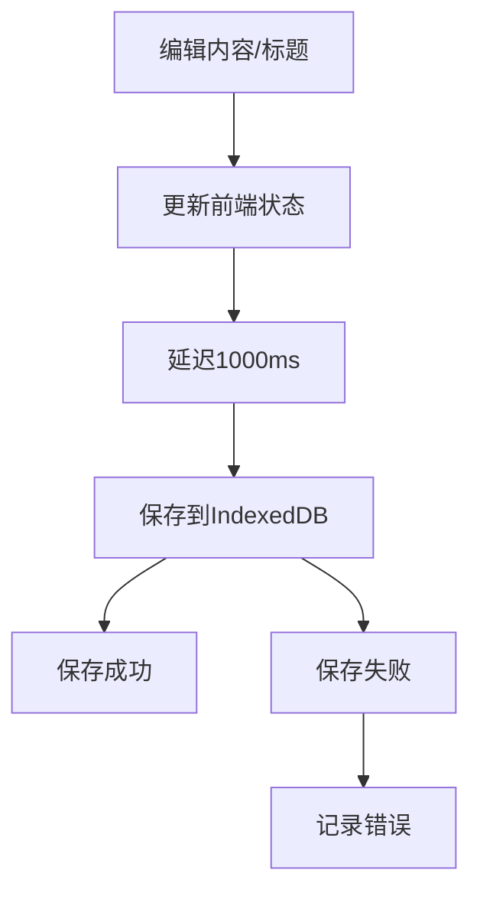

### 流式生成控制系统

创意地图实现了完整的流式生成控制系统，包括生成、终止和状态管理。

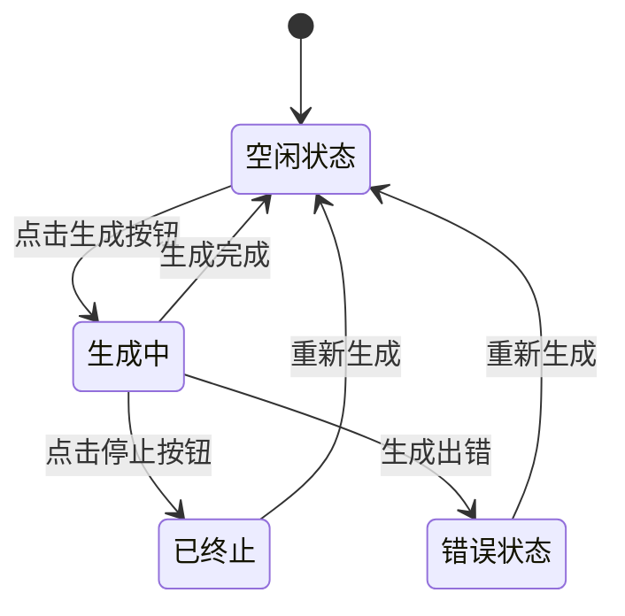

#### 终止生成机制

终止生成机制实现了双重保护：

1. **网络请求中止**: 使用AbortController中止OpenAI API的网络请求
2. **UI更新中止**: 使用本地标志防止已传输但未处理的数据更新UI

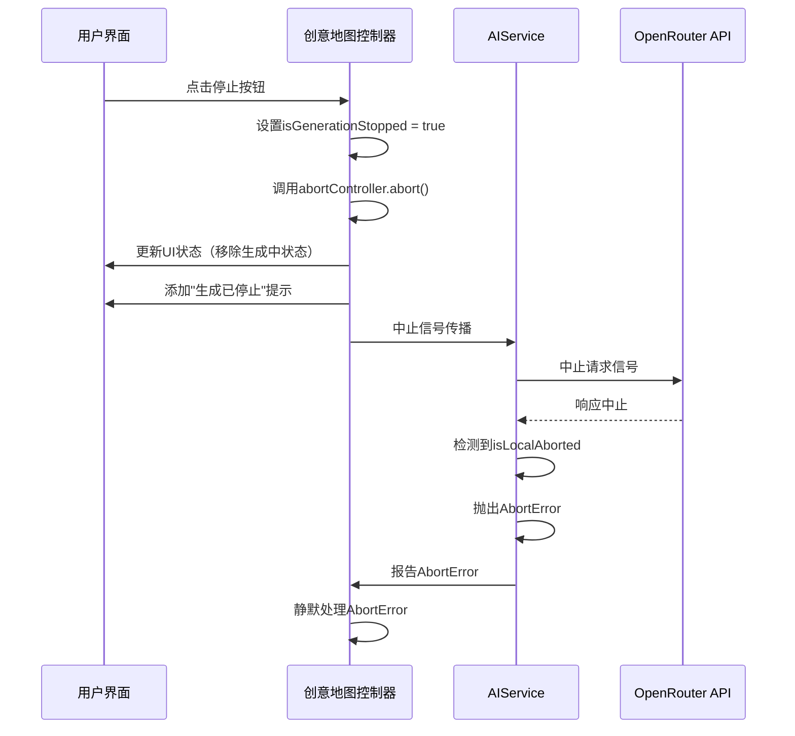

#### 安全清理机制

在新生成开始前，系统会清理任何可能存在的旧请求，并添加短延迟确保完全清理：

```javascript
// 强制清理之前的请求，确保不会有之前的内容继续出现
if (abortControllerRef.current) {
  abortControllerRef.current.abort(); // 中止之前的请求
  abortControllerRef.current = null;
  
  // 等待一小段时间让之前的请求完全清理
  await new Promise(resolve => setTimeout(resolve, 100));
}
```

### 情节设计模块

情节设计模块是创意地图中的重要功能，用于帮助用户设计故事情节结构。

#### 默认模板优化

为了提高用户体验，情节设计模块已优化移除了默认模板，允许用户直接输入自己的需求而不受模板限制：

```javascript
// 情节设计默认模板已更新为空字符串
'plot': ''
```

这项更改涉及以下几个方面的优化：

1. **模板初始化**: 情节设计类型在初始化时使用空字符串而非预设模板
2. **自定义提示词**: 选择自定义提示词时不会显示默认模板，改为完全空白
3. **窗口打开逻辑**: 打开情节设计窗口时，正常设置系统提示词

#### API请求格式说明

创意地图所有功能模块使用统一的API请求格式，分离了提示词和用户输入：

1. **角色分离**: 
   - 提示词选择区域的内容作为系统提示词(System Prompt)
   - 用户输入区域的内容作为用户消息(User Content)

2. **请求格式**:
   ```javascript
   // 所有创意工具的统一请求格式
   {
     "model": "google/gemini-2.0-flash-thinking-exp:free",
     "messages": [
       { "role": "system", "content": "提示词区域的内容（预设提示词或用户自定义提示词）" },
       { "role": "user", "content": "用户在输入区域输入的内容" }
     ],
     "temperature": 0.7,
     "max_tokens": 64000,
     "stream": true
   }
   ```

3. **空值处理**:
   - 当提示词或用户输入为空时，使用字符串"none"代替空字符串
   - 所有创意工具允许提示词和用户输入都可以为空（都会被替换为"none"）
   - 移除了提示词和用户输入不能同时为空的限制
   ```javascript
   // 处理空输入的代码
   const finalUserInput = userInputContent && userInputContent.trim() ? userInputContent : "none";
   const finalSystemPrompt = effectivePrompt && effectivePrompt.trim() ? effectivePrompt : "none";
   ```

4. **提示词选择记忆功能**:
   - 所有创意工具默认优先使用提示词管理中的提示词，而非自定义提示词
   - 系统记住用户最后一次选择的提示词，下次打开时自动选择
   - 自定义提示词输入框始终保持空白或用户上次输入的内容，不会加载预设提示词内容
   - 使用localStorage分别存储每个工具的最后选择和自定义提示词内容
   ```javascript
   // 提示词选择记忆实现
   const getLastUsedPromptId = (id: CreativeMapItemId): string => {
     if (typeof window !== 'undefined') {
       try {
         const key = `zhixia_lastPrompt_${id}`;
         const savedId = localStorage.getItem(key);
         return savedId || 'custom';
       } catch (e) {
         console.error('读取上次使用的提示词失败', e);
       }
     }
     return 'custom';
   };
   
   // 获取上次用户输入的自定义提示词内容
   const getLastCustomPrompt = (id: CreativeMapItemId): string => {
     if (typeof window !== 'undefined') {
       try {
         const key = `zhixia_lastCustomPrompt_${id}`;
         return localStorage.getItem(key) || '';
       } catch (e) {
         console.error('读取上次自定义提示词失败', e);
       }
     }
     return '';
   };
   
   // 选择提示词时不会影响自定义提示词内容
   if (value !== 'custom') {
     const selectedPrompt = prompts[id]?.find(p => p.id === parseInt(value));
     if (selectedPrompt) {
       newPromptContent = selectedPrompt.content;
     }
   } else {
     // 选择自定义提示词时，保留当前自定义提示词内容（可能为空）
     newPromptContent = modalStates[id].customPrompt || '';
   }
   ```

这种设计使所有创意工具保持一致的使用体验，给予用户最大的灵活性。用户可以选择只使用提示词，只使用用户输入，同时使用两者，或者都不填写（都使用"none"）。